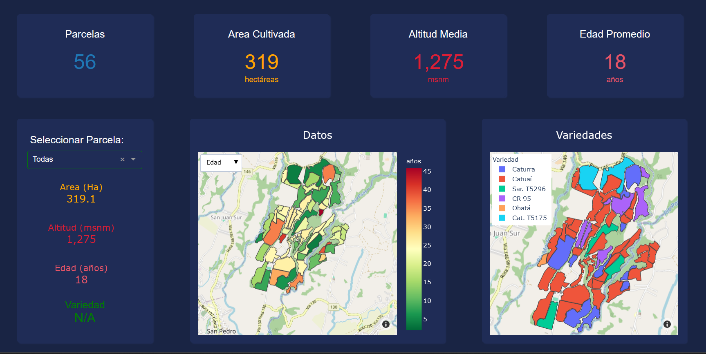

# Beanalytics: Enhancing Coffee Farming Efficiency through Data-Driven Insights

This project involves the development of a web application designed to improve coffee farming through data-driven insights. Aimed at enhancing operational efficiency and profitability, the application focuses on the granular collection and analysis of field data. It serves as an instrument for evaluating the impact of innovative farming techniques on coffee cultivation. 

At the core of the project lies the integration of third-party applications, facilitating the seamless aggregation of data related to labor and inputs directly into QuickBooks. This integration enables cost accounting practices, laying a solid foundation for financial analysis and management. 

The web application acts as a central hub, amalgamating additional data pertaining to environmental and agricultural metrics. This data undergoes cleaning and processing to ensure its readiness for in-depth analysis. The application's ability to transform raw data into a structured format paves the way for the generation of insightful visualizations, significantly enhancing decision-making processes.

By leveraging the power of data analytics, this project not only aimed to boost the profitability of coffee farming but also sought to foster sustainable agricultural practices. It represents a leap forward in the application of technology to agriculture, offering a scalable solution that could potentially benefit various sectors within the industry.

